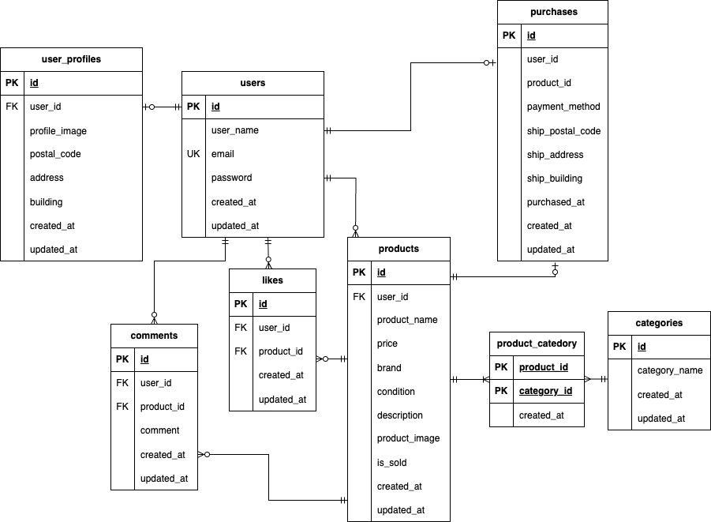

# mock-case1  
coachtechフリマ

## 概要  
本プロジェクトは模擬案件1回目として作成されたフリマアプリケーションです。

---

## インストール方法
### Dockerビルド
1. リポジトリをクローン  
   ```bash
   git clone git@github.com:Ami-3110/mock_case1.git

2. DockerDesktopアプリを立ち上げる。
3. Dockerコンテナをビルド＆起動
    docker-compose up -d --build

        注意（Mac M3チップなどARM系CPUの場合）
        no matching manifest for linux/arm64/v8 in the manifest list entries のエラーが出てビルドできない場合は、docker-compose.ymlのmysqlサービスに以下を追記してください。

    mysql:
        image: mysql:8.0.26
        platform: linux/x86_64  # ← この行を追加
        environment:


### Laravel環境構築
    1. PHPコンテナに入る
        docker-compose exec php bash
    2. Composerでパッケージインストール
        composer install
        npm install && npm run dev
    3. .env.example をコピーして .env にリネーム
        cp .env.example .env
    4. .env のデータベース接続設定を修正
        DB_CONNECTION=mysql
        DB_HOST=mysql
        DB_PORT=3306
        DB_DATABASE=laravel_db
        DB_USERNAME=laravel_user
        DB_PASSWORD=laravel_pass
    5. アプリケーションキーの作成
        php artisan key:generate
    6. ストレージリンクの作成
        php artisan storage:link
    7. マイグレーション・シーディングの実行
        php artisan migrate --seed

#### メール送信（開発環境用）
本プロジェクトでは開発用に MailHog を使用しています。  
メール送信処理を確認したい場合は、以下のURLから確認できます。

- MailHog: http://localhost:8025

※ `.env` で `MAIL_HOST=mailhog` が指定されている必要があります。


### フロントエンドビルド（Vite）
このプロジェクトは Laravel 10 + Vite を使用しています。初回セットアップ時には以下の手順を実行してください。

1. Node.js / npmのインストール  
   Node.js（v18以上推奨）が必要です。  
   - macOSの場合：  
     ```bash
     brew install node
     ```
   - Windowsの場合：  
     Node.js公式サイトからインストーラを利用  

2. npmパッケージのインストール  
   ```bash
   npm install
   ```

3. Vite 開発サーバー起動（開発環境の場合）  
   ```bash
   npm run dev
   ```
   ※ ポート5173が他で使われていないことを確認してください

4. 本番用ビルド  
   ```bash
   npm run build
   ```

## URL
    Laravelアプリが正しく起動していると、以下のURLからアクセスできます。
    - 一覧画面（ダッシュボード）: http://localhost/
    - ログイン画面: http://localhost/login
    - 新規登録画面: http://localhost/register


## 使用技術
- Laravel 12.18.0  
- Vite 6.3.5
- Node.js 20.15.1
- npm 10.9.1
- PHP 8.2.20
- MySQL 8.0.42
- Stripe API（Checkoutセッションを利用して、購入時にStripeへ遷移するクレジットカード決済機能を実装済み。実際の支払い処理はStripe側で完結）
- PHPUnit（テスト用フレームワーク）


## ER図

または別添スプレッドシート(テーブル仕様書)参照


## ログイン情報
| ユーザー名     | メールアドレス                                       | パスワード    | 備考                  |
| --------- | --------------------------------------------- | -------- | ------------------- |
| 正内正       | [user1@example.com](mailto:user1@example.com) | masa0000 | アイコン：banana.png     |
| 胡麻斑ごま     | [user2@example.com](mailto:user2@example.com) | goma0000 | アイコン：grapes.png     |
| 正内小正      | [user3@example.com](mailto:user3@example.com) | komasa00 | アイコン：kiwi.png       |
| ウォーレンケアンズ | [user4@example.com](mailto:user4@example.com) | warlen00 | アイコン：melon.png      |
| 氷見野ペン     | [user5@example.com](mailto:user5@example.com) | pen00000 | アイコン：muscat.png     |
| 南川野今子     | [user6@example.com](mailto:user6@example.com) | ima00000 | アイコン：peach.png      |
| 漢田虎男      | [user7@example.com](mailto:user7@example.com) | torao000 | アイコン：pineapple.png  |
| 熊田くま夫     | [user8@example.com](mailto:user8@example.com) | kumao000 | アイコン：strawberry.png |

    ※ 全ユーザーに対してメール認証は既に完了済みの状態です（email_verified_at 設定済み）。
    ※ 住所・建物名はすべて架空の値で統一されています。

## 機能一覧
- 会員登録 / ログイン / ログアウト
- 商品の出品（※一度出品すると編集・削除はできません）
- 商品の一覧 / 詳細表示
- 商品の購入（Stripe決済連携）
- いいね機能（マイリストとして保存）
- コメント機能（商品ごと）
- マイページ（プロフィール編集、出品/購入商品一覧）
- 商品画像 / プロフィール画像のアップロード（ストレージ保存）
