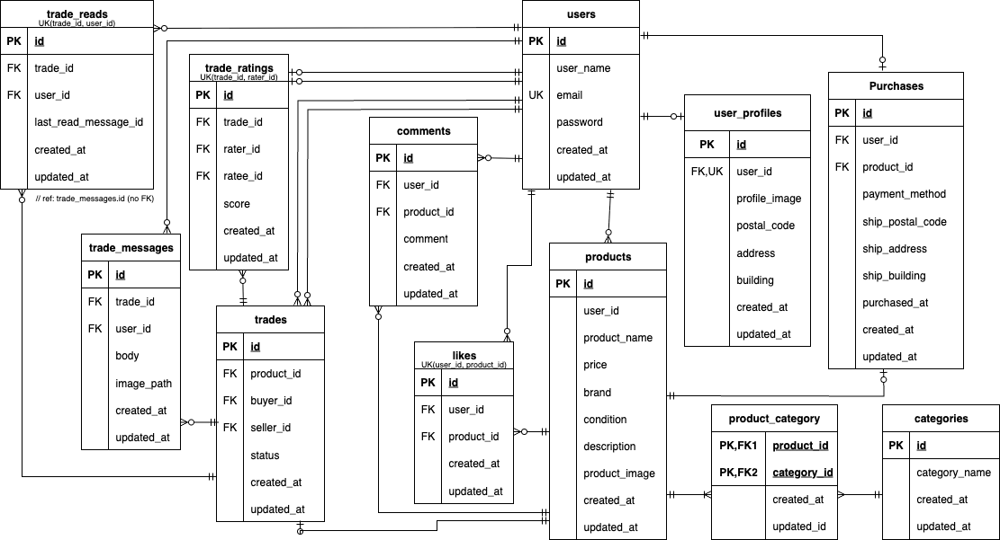

# mock-case1
 coachtechフリマ

## 概要
本プロジェクトは模擬案件１回目です。

## インストール方法
### Dockerビルド
    1. git clone git@github.com:Ami-3110/exercise3.git
        cd exercise3
    2. DockerDesktopアプリを立ち上げる。
    3. Dockerコンテナをビルド＆起動
        docker-compose up -d --build

        注意（Mac M3チップなどARM系CPUの場合）
        no matching manifest for linux/arm64/v8 in the manifest list entries のエラーが出てビルドできない場合は、docker-compose.ymlのmysqlサービスに以下を追記してください。

        mysql:
            image: mysql:8.0.26
            platform: linux/x86_64  # ← この行を追加
            environment:

### Laravel環境構築
    1. PHPコンテナに入る
        docker-compose exec php bash
    2. Composerでパッケージインストール
        composer install
    3. .env.example をコピーして .env にリネーム
        cp .env.example .env
    4. .env のデータベース接続設定を修正
        DB_CONNECTION=mysql
        DB_HOST=mysql
        DB_PORT=3306
        DB_DATABASE=laravel_db
        DB_USERNAME=laravel_user
        DB_PASSWORD=laravel_pass
    5. アプリケーションキーの作成
        php artisan key:generate
    6. マイグレーションの実行
        php artisan migrate
    7. シーディングの実行
        php artisan db:seed

### フロントエンドビルド（Vite）
このプロジェクトは Laravel 10 + Vite を使用しています。初回セットアップ時には以下の手順を実行してください。

    1.　Node.js / npmのインストール
        Node.js（v18以上推奨）が必要です。
        -　macOSの場合：brew install node
        -　Windowsの場合：Node.js公式サイトからインストーラを利用

    2.　npmパッケージのインストール
    npm install
    3. PostCSS/TailwindCSS 設定ファイルの注意
        - postcss.config.js は postcss.config.cjs にリネームしCommonJS形式で書くことを推奨
        - 同様に tailwind.config.js も .cjs にして問題を避けることができます
    4. Vite 開発サーバー起動（開発環境の場合）
        npm run dev
        - ポート5173が他で使われていないことを確認してください
    5. 本番用ビルド
        npm run build

## URL
    Laravelアプリが正しく起動していると、以下のURLからアクセスできます。
    - 一覧画面（ダッシュボード）: http://localhost/
    - ログイン画面: http://localhost/login
    - 新規登録画面: http://localhost/register

## 使用技術
- PHP 8.2.20-fpm-alpine
- Laravel 12.0  
- MySQL 8.0.42
- Node.js 18+
- Vite 6.3.5
- TailwindCSS（PostCSS経由）

## ER図


## ログイン情報
    
# フリマアプリ「Mock Case 1」

このアプリは、ユーザー登録から出品・購入・プロフィール管理までできる**簡易フリマアプリ**です。Laravelを使って、ログイン機能や画像アップロード、購入処理などを実装しています。

## 🌟 機能一覧

- ユーザー登録・ログイン（メール認証付き）
- プロフィール編集（アイコン画像・名前）
- 商品の出品（画像・カテゴリ・状態・価格など）
- 商品一覧・詳細ページ
- 商品の購入処理（Stripe決済対応予定）
- マイページ機能（出品・購入履歴のタブ切り替え）
- コメント・いいね機能（オプション）
- 住所入力・変更（購入時）

## 🛠 使用技術

| 項目 | 内容 |
|------|------|
| フレームワーク | Laravel 10 |
| データベース | MySQL |
| 認証 | Laravel Breeze（Email Verification 使用） |
| フロント | Blade / CSS / JavaScript（Choices.jsなど） |
| 画像保存 | Storage（`public` ディスク） |
| その他 | Stripe（予定）|

## 📦 セットアップ手順（ローカル環境）

```bash
git clone https://github.com/yourusername/mock-case_1.git
cd mock-case_1

# 依存関係のインストール
composer install
npm install && npm run dev

# 環境ファイルの作成
cp .env.example .env

# アプリキー生成
php artisan key:generate

# DBマイグレーション＆シーディング
php artisan migrate --seed

# ストレージリンク作成
php artisan storage:link

# サーバー起動
php artisan serve
